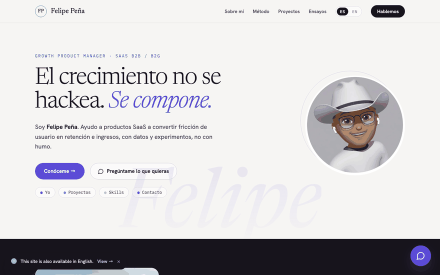
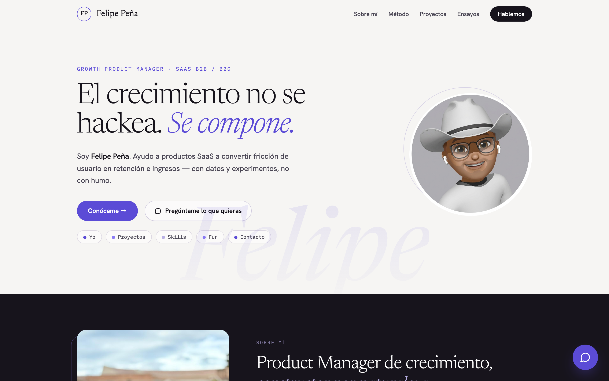
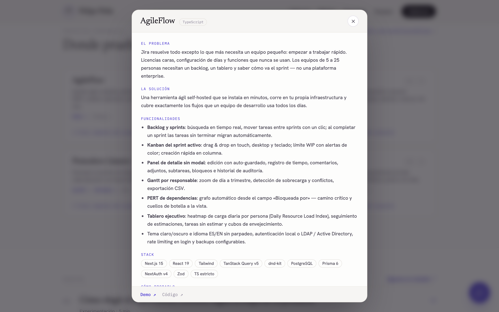
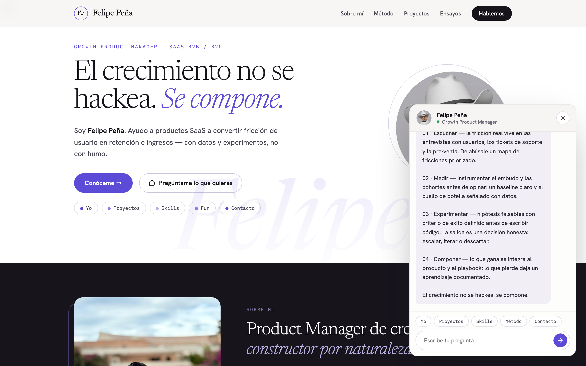
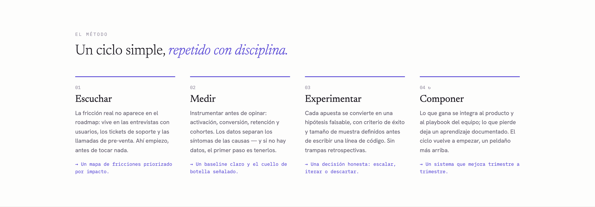
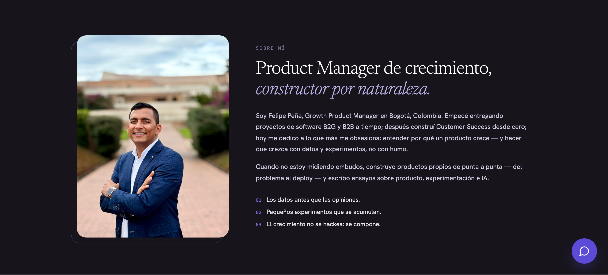

<div align="center">
  

  <h1>Portfolio — Felipe Peña</h1>
  <p><strong>La marca personal de un Growth Product Manager: el crecimiento no se hackea, se compone.</strong></p>

  
  
  

  **[→ Ver el sitio en vivo](https://castellanosfelipe.github.io/Portfolio/)**

</div>

---

## 📋 Tabla de Contenidos

- [¿Qué es este portafolio?](#-qué-es-este-portafolio)
- [Demo en vivo](#-demo-en-vivo)
- [Características principales](#-características-principales)
- [Capturas de pantalla](#-capturas-de-pantalla)
- [Métricas de éxito](#-métricas-de-éxito)
- [Instalación rápida](#-instalación-rápida)
- [Cómo usar](#-cómo-usar)
- [Arquitectura](#-arquitectura)
- [Roadmap](#-roadmap)
- [Licencia y créditos](#-licencia-y-créditos)

---

## 🎯 ¿Qué es este portafolio?

Es el sitio de marca personal de **Felipe Peña**, Growth Product Manager en Bogotá, Colombia. Y está construido como pienso los productos: el visitante es un usuario con un job-to-be-done — evaluar en pocos minutos si vale la pena hablar conmigo — y cada sección existe para mover esa decisión, no para decorar.

### El problema que resuelve

Un CV estático dice qué cargos tuviste, pero no muestra **cómo piensas**. Quien evalúa a un Product Manager necesita ver su método, sus decisiones y sus productos funcionando — y normalmente eso está disperso entre LinkedIn, GitHub y documentos sueltos. Cada salto entre plataformas es fricción, y la fricción mata conversión.

### La solución

Un funnel de una sola página con una sola conversión: **que el visitante correcto escriba**. El recorrido reduce fricción en cada paso — método de trabajo con entregables concretos, seis proyectos con ficha de caso de producto y demo funcionando, cuatro ensayos que muestran criterio, y un chat integrado que responde las preguntas típicas de un reclutador sin esperar respuesta de nadie.

### ¿Para quién es?

| Audiencia | Job-to-be-done que resuelve |
|-----------|----------------------------|
| Recruiters y hiring managers | Evaluar trayectoria, método y evidencia real de producto en minutos, sin agendar una llamada |
| Comunidad de producto | Leer ensayos sobre experimentación, Product-Market Fit e IA aplicada al día a día de un PM |
| Clientes y colaboradores potenciales | Entender cómo trabajo antes del primer contacto — y escribirme con un clic |

---

## 🎬 Demo en vivo

El sitio está publicado y funcionando en GitHub Pages:

[](https://castellanosfelipe.github.io/Portfolio/)

<div align="center">
  
  <p><em>Flujo principal: del hero a la ficha de caso de producto — problema, solución, funcionalidades y stack sin salir de la página.</em></p>
</div>

<div align="center">
  
  <p><em>El chat responde por mí: trayectoria, método y proyectos en segundos — cero fricción para el visitante que evalúa rápido.</em></p>
</div>

---

## ✨ Características principales

| Feature | Qué mueve en el funnel |
|---------|------------------------|
| 🧭 **Narrativa de marca personal** | Hero con posicionamiento claro, "Sobre mí" con foto, trayectoria en tres actos con logros concretos y método en cuatro pasos con entregables — el visitante entiende el valor en el primer scroll |
| 💬 **Chat asistente integrado** | Responde trayectoria, proyectos, skills, método y contacto con chips guiados y enrutado de preguntas libres. Convierte curiosidad en información sin backend ni esperas |
| 🗂️ **Fichas de proyecto en modal** | Seis proyectos presentados como casos de producto (problema → solución → funcionalidades → stack → roadmap), tomados de los README reales de cada repositorio. Evidencia, no adjetivos |
| ✍️ **Ensayos de producto** | Cuatro ensayos sobre experimentación, PMF e IA con páginas propias — retención para el lector que quiere profundidad |
| 🎨 **Diseño editorial** | Tipografía serif/mono, animaciones de entrada y cursor fluido: la primera impresión también comunica estándar de calidad |
| 🚀 **Publicación automática** | Cada push a `main` despliega en GitHub Pages sin build step — tiempo de fricción detectada a mejora publicada: minutos |

---

## 📸 Capturas de pantalla

### Portada — el posicionamiento en 5 segundos
<div align="center">
  
  <p><em>El primer pantallazo responde quién soy, qué hago y qué creo — y ofrece dos rutas: conocerme o preguntarle al chat.</em></p>
</div>

### Ficha de proyecto — evidencia en formato caso de producto
<div align="center">
  
  <p><em>Cada proyecto se defiende solo: problema, solución, funcionalidades y stack, con demo y código a un clic.</em></p>
</div>

### Chat — la conversación que un CV no puede tener
<div align="center">
  
  <p><em>El visitante pregunta, el sitio responde: aquí explicando el método de trabajo en cuatro pasos con entregables.</em></p>
</div>

### Método — cómo trabajo, con entregables y no promesas
<div align="center">
  
  <p><em>Escuchar → Medir → Experimentar → Componer: cada paso termina en un entregable concreto, como debe ser.</em></p>
</div>

### Sobre mí — la persona detrás del funnel
<div align="center">
  
  <p><em>Foto real, historia real y tres principios: datos antes que opiniones, experimentos que se acumulan, crecimiento que se compone.</em></p>
</div>

---

## 📈 Métricas de éxito

Este sitio tiene una sola conversión y la mido como cualquier producto:

| Señal | Qué valida |
|-------|-----------|
| **Mensajes recibidos** (mail / LinkedIn) | La conversión final: el visitante correcto decidió escribir |
| **Clics a demos y repositorios** | La evidencia interesa — los proyectos hacen su trabajo |
| **Interacciones con el chat** | El formato responde dudas reales antes del primer contacto |
| **Lecturas de ensayos** | El contenido retiene a la audiencia de producto |

> La instrumentación de analítica está en el roadmap; hoy la fuente de verdad son los mensajes que llegan.

---

## 🚀 Instalación rápida

### Prerrequisitos

- Un navegador moderno. Nada más.
- (Opcional) Python 3 o Node.js para servirlo en local.

### Pasos

```bash
# 1. Clonar el repositorio
git clone https://github.com/castellanosfelipe/Portfolio.git
cd Portfolio

# 2. Servir en local (no hay dependencias que instalar)
python3 -m http.server 8000

# 3. Abrir en el navegador
open http://localhost:8000
```

✅ Si todo está correcto, verás la portada con el titular **"El crecimiento no se hackea. Se compone."** y el cursor fluido reaccionando al movimiento.

---

## 💡 Cómo usar

### Personalizar la identidad

El nombre y el correo se definen como propiedades al final de `index.html` y se propagan a todo el sitio (nav, hero, chat y footer):

```html
<script type="text/x-dc" data-dc-script data-props="{
  &quot;name&quot;:  { &quot;default&quot;: &quot;Felipe Peña&quot; },
  &quot;email&quot;: { &quot;default&quot;: &quot;correo@ejemplo.com&quot; },
  &quot;chatEnabled&quot;: { &quot;default&quot;: true }
}">
```

### Añadir un ensayo

```bash
# 1. Crear la página del ensayo (usar una existente como plantilla)
cp ensayos/pmf-sostener-y-expandir.html ensayos/mi-nuevo-ensayo.html

# 2. Enlazarlo en la sección "Ensayos" de index.html
#    (copiar uno de los bloques <a href="ensayos/..."> existentes)
```

### Añadir un proyecto con su ficha

1. Duplicar una tarjeta en la sección `<!-- PROYECTOS -->` de `index.html`.
2. Duplicar su panel en `<!-- FICHAS DE PROYECTO (MODAL) -->`.
3. Registrar el par botón/panel en `renderVals()` (`openFichaX` y `fichaX`).

### Regenerar las capturas de este README

```bash
# Requisitos (solo la primera vez)
pip3 install --user playwright pillow
python3 -m playwright install chromium

# Servir el sitio y capturar
python3 -m http.server 8899 &
python3 scripts/capture.py
```

Genera los screenshots en `docs/screenshots/` y los GIFs en `docs/media/`.

### Publicar cambios

```bash
git add . && git commit -m "Descripción del cambio" && git push origin main
# GitHub Pages despliega automáticamente en 1-2 minutos
```

---

## 🧱 Arquitectura

Sitio 100% estático, sin build step, sin bundler y sin dependencias de npm.

| Capa | Tecnología | Propósito |
|------|-----------|-----------|
| Interfaz | HTML + estilos inline + Google Fonts (Newsreader, Hanken Grotesk, IBM Plex Mono) | Diseño editorial de una sola página |
| Componentes | `support.js` — plantillas declarativas con estado | Chat flotante, modales de ficha y reactividad de la UI |
| Efectos | `fluid-cursor.js` | Simulación de fluido que sigue al cursor en la portada |
| Contenido | `ensayos/*.html` | Páginas independientes por ensayo, con enlace de vuelta a la portada |
| Documentación | `scripts/capture.py` — Playwright + Pillow | Screenshots y GIFs de este README, regenerables con un comando |
| Hosting | GitHub Pages + `.nojekyll` | Deploy automático en cada push a `main`, sirviendo los archivos tal cual |

---

## 🚧 Roadmap

### ✅ Completado
- [x] Portada de marca personal: hero, sobre mí con foto, método en 4 pasos y trayectoria con logros
- [x] Seis proyectos con ficha de caso de producto en modal, basada en los README reales de cada repo
- [x] Chat asistente con chips guiados y enrutamiento de preguntas libres
- [x] Cuatro ensayos con páginas propias y URLs limpias
- [x] Despliegue automático en GitHub Pages
- [x] Capturas y GIFs de demo generados con Playwright, regenerables con `scripts/capture.py`

### 🔮 Próximamente
- [ ] Instrumentar analítica de producto (la sección de métricas pide datos, no intuiciones)
- [ ] Metadatos SEO y Open Graph (título, descripción e imagen al compartir el enlace)
- [ ] Favicon propio
- [ ] Versión en inglés del sitio

---

## 📄 Licencia y créditos

El código de esta página puede usarse como referencia. Los textos, ensayos y fotografías son contenido personal — © 2026 Felipe Peña, todos los derechos reservados.

---

<div align="center">
  <p>Hecho con ❤️ por <a href="https://github.com/castellanosfelipe">castellanosfelipe</a></p>
</div>
